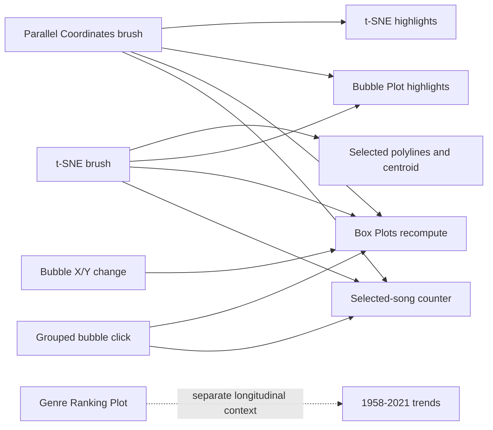
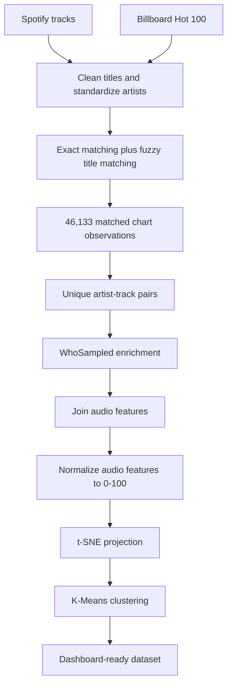

# SpotyVis - Exploring the Audio DNA of Hit Songs

[](https://d3js.org/)
[](https://www.python.org/)
[](https://scikit-learn.org/)
[](https://mattia9203.github.io/Visual-Analytics-Project/visualization/)

**SpotyVis** is an interactive visual analytics dashboard for investigating the characteristics, similarity, influence, and historical evolution of popular music. It combines Spotify audio features, Billboard Hot 100 chart history, and metadata collected from WhoSampled to expose the hidden patterns behind hit songs.

The project moves beyond static rankings and playlists. Its coordinated views let users move from a high-level map of musical similarity to individual songs, filter tracks by multiple audio properties, compare statistical distributions, and follow genre rankings across more than six decades.

> Can we visualize the DNA of a hit song?

## Project links

- **[Open the live dashboard](https://mattia9203.github.io/Visual-Analytics-Project/visualization/)**
- **[Read the final project report](docs/VA_Project_FinalVersion.pdf)**
- **[View the project presentation](docs/Presentation.pdf)**
- **[Read the original proposal](docs/Visual_Analytics_Proposal.pdf)**

## Why SpotyVis?

Music is experienced emotionally, but every digital track can also be described as a high-dimensional data point. Properties such as energy, danceability, loudness, acousticness, instrumentalness, speechiness, liveness, and valence offer a numerical representation of a song's sonic profile.

SpotyVis turns these attributes into an explorable visual space. It was designed to support questions such as:

- Which songs have similar audio profiles, even when they belong to different genres?
- Do popular songs share recognizable combinations of energy, loudness, and valence?
- Is current popularity related to long-term cultural influence through covers, samples, and remixes?
- How have the relative positions of musical genres changed from 1958 to 2021?
- What is the average audio fingerprint of a user-selected cluster of songs?
- Can audio-based filtering reveal relationships that genre labels alone hide?

## Core features

- **Coordinated multiple views:** selections made in one visualization update the relevant linked views.
- **High-dimensional exploration:** eight normalized audio features can be inspected and filtered simultaneously.
- **Similarity mapping:** a precomputed t-SNE projection places sonically similar songs near one another.
- **Musical clustering:** K-Means divides the projection into eight interpretable regions.
- **Flexible feature comparison:** users can assign different numerical attributes to the X and Y axes of the Bubble Plot.
- **Dynamic aggregation:** songs can be grouped by a selected attribute, with bubble size encoding the number of tracks in each group.
- **Triggered analytics:** brushing the t-SNE view computes and displays the selected songs' average audio profile in real time.
- **Longitudinal analysis:** an independent ranking view shows genre trends by year, custom year range, or month within a selected year.
- **Details on demand:** tooltips reveal track, artist, genre, group size, and ranking information without cluttering the interface.

## Dashboard views

| View | Analytical purpose | Main interactions |
| --- | --- | --- |
| **t-SNE Scatterplot** | Maps 2,624 tracks into a two-dimensional similarity space. Nearby points have similar audio-feature profiles; color identifies the K-Means cluster. | Hover for track details and brush a region to select similar songs. |
| **Bubble Plot** | Compares any two available numerical attributes on customizable axes. In grouped mode, position represents group averages and bubble size represents track count. | Change X/Y attributes, choose a grouping variable, inspect tooltips, and click an aggregated bubble. |
| **Box Plots** | Summarize the current X and Y attributes through minimum, first quartile, median, third quartile, and maximum. | Recompute automatically when axes or the active track subset changes. |
| **Parallel Coordinates Plot** | Displays the full eight-dimensional audio profile of every track on normalized 0-100 axes. | Brush one or more axes to create compound filters; reset filters with one action. |
| **Genre Ranking Plot** | Shows average Billboard rank trajectories and makes changes in musical taste visible over time. | Add or remove genres, enter a year or range, switch between annual and monthly views, and inspect values through tooltips. |

### Coordinated interaction model

The first four views operate as a linked analytical system. The ranking plot intentionally remains independent because it uses a separate longitudinal dataset and provides historical context rather than track-level filtering.



## Dimensionality reduction and clustering

The browser receives precomputed coordinates rather than running dimensionality reduction at runtime. This keeps interaction responsive and makes the projection reproducible.

The preprocessing uses these eight Spotify audio features:

1. Danceability
2. Energy
3. Loudness
4. Speechiness
5. Acousticness
6. Instrumentalness
7. Liveness
8. Valence

All features are transformed to a common **0-100 scale** before dimensionality reduction. Values already defined in the 0-1 range are multiplied by 100, while loudness is min-max normalized.

### t-SNE configuration

| Parameter | Value |
| --- | --- |
| Components | 2 |
| Perplexity | 40 |
| Iterations | 1,000 |
| Initialization | PCA |
| Learning rate | Automatic |
| Random state | 42 |

t-SNE was selected because the project focuses on preserving local neighborhoods: songs with comparable audio profiles should remain close in the projected space. The two axes do not have a direct musical interpretation; their purpose is to encode relative proximity.

### K-Means configuration

K-Means is applied to the resulting two-dimensional t-SNE coordinates with `k = 8`, `n_init = 10`, and `random_state = 0`. The cluster label controls the color of each point in the t-SNE view.

The dashboard uses the following human-readable labels to make the eight regions easier to discuss:

| Cluster | Interpretive label |
| --- | --- |
| 0 | Classic Rock & Pop |
| 1 | Euphoric Mainstream Hits |
| 2 | Acoustic Pop & Country |
| 3 | High-Energy Alternative |
| 4 | Energetic Pop/Rock |
| 5 | Melancholic Pop |
| 6 | Happy Classic Rock & Blues |
| 7 | Retro Dance & Rock |

These names are interpretive summaries of the observed regions, not ground-truth genre classifications.

## Data

SpotyVis combines three complementary sources:

- **Spotify Tracks Dataset:** track metadata, genre labels, popularity, and numerical audio features.
- **Billboard Hot 100 Dataset:** weekly ranking history used both to select widely recognized songs and to analyze long-term genre trends.
- **WhoSampled:** publication year and cultural-influence indicators, including covers, samples, and remixes.

### Dataset roles

| File | Rows | Role in the project |
| --- | ---: | --- |
| `dataset/dataset.csv` | 114,000 | Source Spotify track and audio-feature data. |
| `dataset/charts.csv` | 330,087 | Source Billboard chart history. |
| `dataset/merged_common_songs.csv` | 46,133 | Spotify-compatible Billboard observations used by the ranking plot. |
| `dataset/charts_whosampled.csv` | 2,624 | Unique matched tracks enriched with WhoSampled metadata. |
| `dataset/final_imputed_data.csv` | 2,624 | Enriched master data joined with Spotify audio attributes. |
| `dataset/final_imputed_data_normalized.csv` | 2,624 | Master data with normalized audio attributes. |
| `dataset/final_dataset_kmeans.csv` | 2,624 | Dashboard-ready master data with t-SNE coordinates and cluster labels. |

The application loads two files directly:

- `final_dataset_kmeans.csv` powers the t-SNE, Bubble Plot, Box Plots, and Parallel Coordinates Plot.
- `merged_common_songs.csv` powers the independent genre-ranking analysis.

### Data integration pipeline



The matching stage first creates normalized artist-title keys. Unmatched titles are then compared with token-sort fuzzy matching using a score threshold of 85, followed by an artist-consistency check. This approach recovers formatting variants while reducing false matches.

The WhoSampled collector includes resumable CSV output, rotating user-agent strings, randomized delays, and exponential backoff for HTTP 403 responses. Because scraping policies and page structures can change, this step should only be rerun after reviewing the website's current terms and applicable access rules.

## Analytical findings

The dashboard supported several findings documented in the final report:

1. **Current popularity is not the same as cultural influence.** Popularity and cover count do not show a direct linear relationship. A seasonal holiday track appears as an extreme case with low current popularity but more than 400 covers, while enduring artists can combine strong present-day popularity with extensive reinterpretation.

2. **Audio similarity can cross genre boundaries.** Filtering acousticness to approximately 40-60% captures the expected Classic Rock and Country tracks, but also reveals a smaller group from the High-Energy Alternative cluster. Numerical audio profiles therefore expose relationships that fixed genre labels can conceal.

3. **Energy and loudness are useful but incomplete signals of popularity.** The dashboard reveals a visible group of popular, high-energy, high-loudness songs, while also showing tracks with the same sonic properties and low popularity. Audio features contribute to success but do not determine it alone.

4. **Musical popularity must be analyzed over time.** The ranking view shows genres rising, declining, and crossing one another across decades. These dynamics would be lost in a single aggregate ranking.

## Running the dashboard locally

No frontend build step is required. The application is written in HTML, CSS, native JavaScript modules, and D3.js v7.

### Prerequisites

- A modern desktop browser
- Python 3, Node.js, or any other tool capable of serving static files
- An internet connection on first load for the D3.js and Google Fonts CDNs

### Quick start

```bash
git clone https://github.com/mattia9203/Visual-Analytics-Project.git
cd Visual-Analytics-Project
python3 -m http.server 8000
```

Then open:

```text
http://localhost:8000/visualization/
```

Start the server from the repository root so that the relative paths from `visualization/` to `dataset/` resolve correctly. Opening `index.html` directly through `file://` is not recommended because browsers commonly restrict JavaScript modules and local CSV requests.

## Suggested exploration workflow

1. Open the t-SNE view and hover over several points to inspect track, artist, and genre information.
2. Brush a compact region of the projection. Observe how the Bubble Plot, Box Plots, song counter, and Parallel Coordinates update.
3. Inspect the dashed red centroid in the Parallel Coordinates Plot to understand the average profile of the selected songs.
4. Clear the selection and brush one or more parallel-coordinate axes, for example high energy together with low acousticness.
5. Change the Bubble Plot axes to test a relationship such as popularity versus covered-by count.
6. Enable grouping to compare group size and average feature values, then click a bubble to recompute its box-plot distributions.
7. In Genre Trends, enter a year such as `1995` for a monthly view or a range such as `1980-2000` for a focused historical comparison.
8. Add or remove genres to isolate a specific musical narrative. The default history view selects the five most frequent genres, while the interface supports up to ten at once.

## Optional Python environment

The processed CSV files required by the dashboard are already included, so Python dependencies are not needed to run the visualization. To inspect or extend the data pipeline, create an isolated environment and install the libraries used by the scripts:

```bash
python3 -m venv .venv
source .venv/bin/activate
python -m pip install pandas numpy scikit-learn thefuzz cloudscraper beautifulsoup4
```

The scripts in `src/` document the individual research pipeline stages. They use file-relative paths and are provided primarily for transparency and experimentation; the checked-in processed datasets are the reproducible inputs for the published dashboard.

## Repository structure

```text
Visual-Analytics-Project/
├── dataset/
│   ├── dataset.csv                         # Spotify source data
│   ├── charts.csv                          # Billboard source data
│   ├── merged_common_songs.csv             # Longitudinal matched observations
│   ├── charts_whosampled.csv               # WhoSampled-enriched tracks
│   ├── final_imputed_data.csv              # Enriched master dataset
│   ├── final_imputed_data_normalized.csv   # Normalized audio features
│   └── final_dataset_kmeans.csv             # Final t-SNE/K-Means dataset
├── docs/
│   ├── VA_Project_FinalVersion.pdf          # Final report
│   ├── Presentation.pdf                     # Final presentation
│   └── Visual_Analytics_Proposal.pdf        # Initial proposal
├── src/
│   ├── data.py                              # Cleaning and exact/fuzzy matching
│   ├── webscraping.py                       # WhoSampled enrichment
│   ├── merge.py                             # Feature integration
│   ├── normalize.py                         # 0-100 feature normalization
│   └── preprocessing_tsne+kmeans.py         # Projection and clustering
└── visualization/
    ├── index.html                           # Dashboard structure
    ├── main.js                              # Data loading and view coordination
    ├── tSNE.js                              # Similarity map and brushing
    ├── bubbleplot.js                        # Feature comparison and grouping
    ├── boxplot.js                           # Statistical summaries
    ├── parallel_coordinates.js              # Multivariate filtering and centroid
    ├── rankingplot.js                       # Genre ranking evolution
    └── style.css                            # Responsive dashboard styling
```

## Technology stack

| Area | Technologies |
| --- | --- |
| Visualization | D3.js v7, SVG |
| Frontend | HTML5, CSS3, JavaScript ES modules |
| Data processing | Python, pandas, NumPy |
| Machine learning | scikit-learn t-SNE and K-Means |
| Record linkage | Regular expressions, exact matching, TheFuzz token-sort similarity |
| Data enrichment | Beautiful Soup, CloudScraper |
| Deployment | GitHub Pages |

## What this project demonstrates

- Designing an end-to-end visual analytics workflow, from raw data integration to an interactive public dashboard
- Combining multiple data sources through cleaning, record linkage, fuzzy matching, and enrichment
- Applying dimensionality reduction and clustering to a real high-dimensional dataset
- Building coordinated views and bidirectional brushing with D3.js
- Implementing triggered analytics, including real-time subset statistics and centroid calculation
- Translating exploratory analysis into a clear data story supported by interactive evidence
- Balancing detailed track-level exploration with a separate historical view of industry trends

## Limitations

- t-SNE prioritizes local neighborhood preservation and can distort global distances; separation between distant clusters should not be overinterpreted.
- K-Means is applied to the t-SNE projection rather than directly to the original eight-dimensional feature space, so cluster membership depends on the embedding.
- Cluster names are analyst-assigned interpretations, not official Spotify categories.
- Spotify popularity is a changing platform-specific score and should not be treated as a timeless measure of success.
- WhoSampled metadata reflects the coverage and state of the source at collection time.
- Billboard data represents the United States and does not capture every regional music market.
- The interface is desktop-first and is most effective on a wide display.

## Future work

- Add track and artist search with direct highlighting across all views
- Integrate short audio previews through an authorized playback API
- Add a time slider to animate changes in the musical feature space
- Support hierarchical or user-selectable clustering instead of a fixed `k = 8`
- Introduce guided analytical presets for notable patterns and findings
- Add explicit uncertainty and projection-quality diagnostics
- Improve small-screen and touch-device support

## Academic context

SpotyVis was developed as the final project for the **Visual Analytics** course in the **Master's Degree in Engineering in Computer Science** at **Sapienza University of Rome**, Academic Year 2025/2026.

**Students**

- Bruno Masciotta
- Mattia Maucione


The full methodology, related work, interaction design, findings, and bibliography are available in the [final report](docs/VA_Project_FinalVersion.pdf).

## Disclaimer

This is an academic, non-commercial project. SpotyVis is not affiliated with or endorsed by Spotify, Billboard, or WhoSampled. Product names and trademarks belong to their respective owners.
